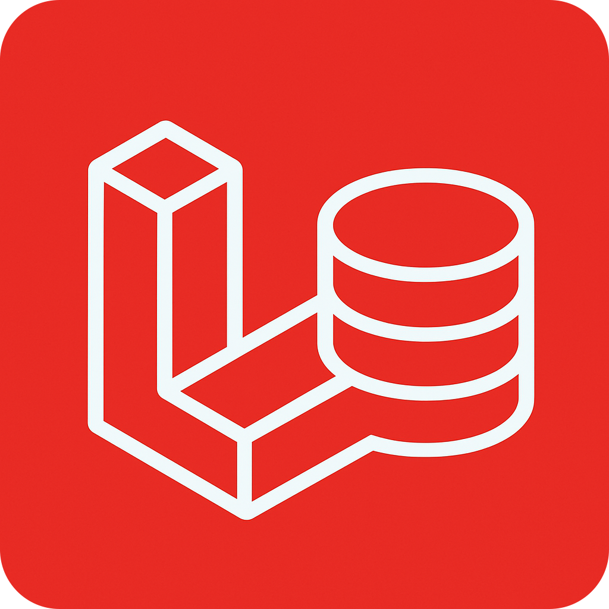

# Larabase

Larabase é um clone do TablePlus, um gerenciador de banco de dados com interface gráfica. Este projeto foi desenvolvido com Electron.js, Vue.js, Pinia, Composition API e DaisyUI.



## Requisitos

- Node.js 16+
- npm ou yarn

## Instalação

Clone o repositório e instale as dependências:

```bash
git clone <url-do-repositorio>
cd larabase
npm install
```

## Desenvolvimento

Para executar em modo de desenvolvimento:

```bash
npm run dev
```

Isso iniciará o servidor de desenvolvimento Vite e o Electron.

## Construção

Para construir o aplicativo:

```bash
npm run build
```

## Funcionalidades Implementadas

- Interface similar ao TablePlus com tema escuro
- Gerenciamento de conexões (mock)
- Visualização das tabelas de banco de dados
- Pesquisa de tabelas
- Sistema de abas para navegação entre tabelas
- Redimensionamento da barra lateral
- Filtro de dados nas tabelas
- Persistência do estado entre recarregamentos

## Notas de Implementação

### Estrutura de Diretórios

- `src/main`: Código do Electron (processo principal)
- `src/renderer`: Código do Vue.js (processo de renderização)
  - `views`: Páginas da aplicação
  - `components`: Componentes reutilizáveis
  - `store`: Stores do Pinia
  - `assets`: Recursos estáticos

### Próximos Passos de Desenvolvimento

- Implementação da funcionalidade de backend real para conexão com bancos de dados
- Adição de recursos para execução de consultas SQL
- Suporte a mais tipos de bancos de dados
- Funcionalidades de edição de dados
- Interface para criação e edição de tabelas

## Licença

MIT
