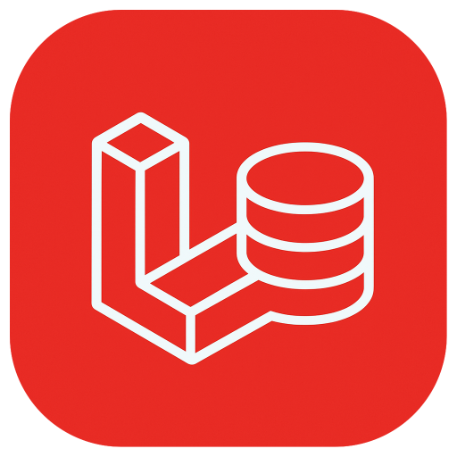

<div align="center">
  
  <h1>Larabase</h1>
  <p>An Opinionated Database GUI for Laravel Developers</p>
</div>

## Overview

Larabase is a specialized desktop application built with Electron and Vue.js, designed specifically for Laravel developers. It enhances productivity by providing seamless integration with Laravel's project structure, database management, and developer workflow.

## Features

### Database Management

- **Connection Management**: Create, edit, and manage database connections
- **Table Visualization**: Browse table contents with sorting and filtering
- **Schema Explorer**: View database schema and relationships
- **Entity Relationship Diagram**: Visual ERD for database tables

### SQL Tools

- **Advanced SQL Editor**: With syntax highlighting using Monaco editor
- **SQL Query Execution**: Run and analyze SQL queries
- **Query History**: Track previously run queries
- **Explain Plans**: View SQL query execution plans

### Laravel Integration

- **Migration Management**: View, run, and roll back migrations
- **Artisan Command Interface**: Run Laravel artisan commands
- **Project Logs**: View and analyze Laravel log files
- **.env Editor**: Easily edit environment configuration

### Development Tools

- **Terminal Emulation**: Execute commands in an integrated terminal
- **Redis Manager**: View and manage Redis cache
- **Live Database Monitoring**: Watch database changes in real-time

### Additional Utilities

- **Database Restore/Dump**: Import and export database content
- **Theme Customization**: Light and dark mode support
- **Auto Updates**: Automated application update notifications

## Technology Stack

- **Electron**: Cross-platform desktop application framework
- **Vue.js 3**: Frontend framework with TypeScript
- **Pinia**: State management
- **Tailwind CSS & DaisyUI**: Styling
- **Monaco Editor**: Code editing experience
- **MySQL2**: Database connectivity
- **AI Integration**: SQL assistance with OpenAI and Google Generative AI

## Development

```bash
# Clone the repository
git clone https://github.com/Tiagospem/larabase.git

# Install dependencies
npm install

# Start the development server
npm run dev

# Build for production
npm run build

# Build for specific platforms
npm run build:mac-apple   # macOS (Apple Silicon)
npm run build:mac-intel   # macOS (Intel)
npm run build:win         # Windows
npm run build:linux       # Linux
```

## SSH Tunneling Support

Larabase now supports connecting to MySQL databases through SSH tunnels. This feature allows you to:

1. Connect to remote database servers securely via SSH
2. Work with databases that are not directly accessible from your machine
3. Maintain the same workflow and functionality as with local database connections

### How SSH Tunneling Works

SSH tunneling creates a secure encrypted channel between your local machine and the remote server:

1. An SSH connection is established to the remote server
2. A local port is forwarded to the remote database server port
3. Your connection uses this local port, which securely tunnels traffic to the remote server
4. All database operations work transparently through this tunnel

### Implementation Details

The SSH tunneling implementation uses:

- The `ssh2` library for SSH connections and port forwarding
- The `portfinder` library to dynamically find available local ports
- The existing MySQL connection module, modified to work through SSH tunnels

### Setup

To use SSH tunneling, you need:

1. SSH access to the remote server (username/password or key-based authentication)
2. The remote server needs access to the MySQL database
3. Create a connection in Larabase with SSH tunneling enabled

### Usage

When creating a new connection, select the SSH option and provide:

1. SSH server details (host, port, username, password/private key)
2. Remote database details (host, port, username, password, database name)

Once connected, you can use all Larabase features as you would with a local database.

## License

This project is licensed under the MIT License - see the LICENSE file for details.

## Author

Tiago Padilha <tiagospem@gmail.com>
