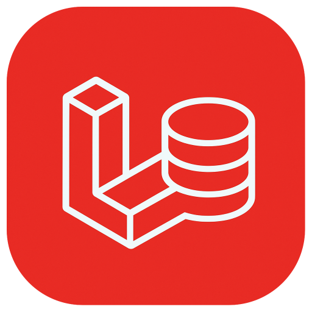

# Larabase

<div align="center">
  
</div>

Larabase is a MySQL GUI manager designed specifically for Laravel developers. It's a TablePlus clone built with Electron.js, Vue.js, Pinia, Composition API, and DaisyUI.

## Features

- Dark-themed interface similar to TablePlus
- Connection management
- Database table browsing and visualization
- Table search functionality
- Tab-based navigation system
- Resizable sidebar
- Data filtering capabilities
- State persistence between application reloads

## Requirements

- Node.js 16+
- npm or yarn

## Installation

Clone the repository and install dependencies:

```bash
git clone https://github.com/yourusername/larabase.git
cd larabase
npm install
```

## Development

Run in development mode:

```bash
npm run dev
```

This will start the Vite development server and launch Electron.

## Building

Build the application:

```bash
npm run build
```

## Project Structure

- `src/main`: Electron code (main process)
- `src/renderer`: Vue.js code (renderer process)
  - `views`: Application pages
  - `components`: Reusable components
  - `store`: Pinia stores
  - `assets`: Static resources

## Roadmap

- Implementation of real backend functionality for database connections
- SQL query execution features
- Support for additional database types
- Data editing capabilities
- Interface for creating and editing tables

## License

MIT
